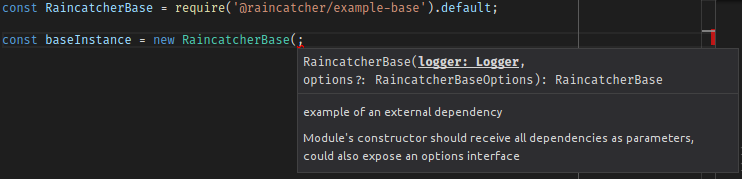

> Workforce management platform

[](https://travis-ci.org/feedhenry-raincatcher/raincatcher-core) [](https://coveralls.io/github/feedhenry-raincatcher/raincatcher-core?branch=master) [](https://gitter.im/FeedhenryRaincatcher/Lobby)

## About RainCatcher

RainCatcher is a Workforce Management platform with the main focus on delivering a set of modules and user interface for mobile developers who want to integrate WFM features into their application.

RainCatcher can be divided into following areas:

- **Workforce Management framework** that provides mobile and website framework for building
Workforce management solutions on top of all supported user interfaces.
- **Set of modules** specific to Workforce management (signatures, scheduler etc.)
- **WFM specific integrations** to provide authentication, storage, offline capabilities and server side synchronization.
- **User interface** implemented in AngularJS and Angular

### Main targets:

- Hybrid mobile development using TypeScript(cordova/web/angular)
- Node.js based server
- Fully object oriented approach (classes and interfaces)
- Focus on reusability and developer flexibility
- All modules in single repository, multiple choice for user interfaces as separate repositories
- Comprehensive documentation
- Incorporates only open-source technologies

## Documentation

http://raincatcher.feedhenry.io/docs

## Contributor Getting Started

To run demo application please follow instructions from
our [Reference User Interface](https://github.com/feedhenry-raincatcher/raincatcher-angularjs) repository.

To contribute your changes, check the [Contribution Guide](./CONTRIBUTING.md) for instructions and also refer to the [Code of Conduct](./CODE_OF_CONDUCT.md) document to understand the commitments done on the part of the contributors and the core team.

## Developing core components

RainCatcher supports and is tested on node v 6.x LTS.

Check your Node.JS version running `node -v`

### Setup

```bash
git clone https://github.com/feedhenry-raincatcher/raincatcher-core.git
cd raincatcher-core
npm install
npm run bootstrap
```
> **Note**: Core server requires `mongodb` and `redis` to be running on machine.

## Repository folder structure

This repository contains many subpackages managed through [Lerna](https://lernajs.io/), and they're
contained in the following directories:

<dl>
  <dt>client/</dt>
  <dd>Front-end packages, from API clients to user interface modules</dd>

  <dt>cloud/</dt>
  <dd>Cloud app packages, intended to be run on an Node.JS environment</dd>

  <dt>demo/</dt>
  <dd>Full-fledged Demo applications, showcasing the usage of multiple modules</dd>

  <dt>templates/</dt>
  <dd>Templates and examples for other packages in the repository</dd>
</dl>

## Creating a new package

In order to create a new package, we recommend duplicating
[`examples/base`](./examples/base/README.md), which is a sample base that contains the skeleton
expected of a new package. Refer to the linked README for more details.

## Package structure

### Directories

<dl>
  <dt>src/</dt>
  <dd>Contains the TypeScript sources.</dd>

  <dt>test/</dt>
  <dd>The unit tests for the module. Should contain a `mocha.opts` file for configuring Mocha.</dd>

  <dt>coverage/ and .nyc_output</dt>
  <dd>Istanbul output, should be .gitignored.</dd>

  <dt>example/ </dt>
  <dd>Example usage for module. </dd>
</dl>

### Module structure

RainCatcher modules are written in [TypeScript](http://typescriptlang.org).

The main files are modules that by default export a class containing the main implementation for the module's intent,
with a named export containing a public interface that should be depended upon, and reimplemented.

```typescript
import Implementation, { PublicInterface } from '@raincatcher/module';
```

See the [Reusing unit tests](#reusing-unit-tests) section in order to know how to leverage the existing test suites on
custom implementations.

#### Default exports

For each module, the default export is the main implementation itself, as the most common scenario is it being used by
the requiring code.

Other RainCatcher modules depend only on the interfaces explained in the [next section](#public-interface)

#### Public interface

Along with the default export, all modules include a public interface definition that are depended upon by other
RainCatcher modules instead of depending on the implementation itself.
See the [BaseModule](examples/base/src/index.ts) for an example.

This is done so they can be more easily replaced or extended by custom implementations.
Custom modules can skip this concern.

#### Unit test structure

For each module unit tests are present on the `test/` folder, the Mocha default for storing the `mocha.opts` file as well.

Since code that requires a module's tests are most likely interested in a reusable test suite, the `test/index.ts` file's default export should be a function that receives all the required parameters for running the test suite on a given implementation of the interface.

```typescript
import publicInterfaceTestSuite from '@raincatcher/module/test';
import { PublicInterface } from '@raincatcher/module';

class MyClass implements PublicInterface {
  // ...
}

// test/MyClass.ts
describe('MyClass', function() {
  publicInterfaceTestSuite(MyClass);
});
```

Tests for the module's specific implementation can be included as other files inside the same folder.

### Using modules from JavaScript

We recommend users to write their code in TypeScript, especially if their new RainCatcher-based solution is a greenfield project, however JavaScript usage is partially supported by editor plugins that will still offer suggestions based on the TypeScript interfaces and access to jsdoc annotations:



See the example on [examples/js]() for more information also for reusing the unit test suites from JavaScript code.

### Repository commands

- `npm run test` - run unit tests
- `npm run bootstrap` - perform boostrap for all modules
- `npm run build` - execute the build command for all modules, compiling TypeScript sources to JavaScript
- `npm run start:ts` - run top level applications from the TypeScript sources
- `npm run start` - run top level applications from the compile JavaScript, you must run `npm run build` before this command
- `npm run lint` - execute tslint for all modules
- `npm run cleanInstall` - perform install without executing additional scripts
- `npm run update:check` - check for updates in all the existing packages in the repository
- `npm run update:run` - execute updates and rewrite the `package.json` in all the existing packages in the repository

#### Publishing

The repository also includes a set of commands for publishing both the standalone modules and the contained applications.

- `npm run publish:prepare` - builds TS sources and setups dependencies for publishing packages
- `npm run publish:test` - runs a test of publishing packages to a local npm registry via the [Verdaccio](https://github.com/verdaccio/verdaccio) project
- `npm run publish:full` - prepares packages and tries to publish to the public registry, requires human input for confirming the version bumps, see the [lerna publish](https://github.com/lerna/lerna#publish) documentation for more information.
- `npm run publish:dry` - does a dry-run of the publish scripts for local test purposes, avoiding any permanent changes to git history or npm registries
- `npm run publish:demo-server` - publishes the `demo/server` application to the feedhenry-templates repository as part of the project's inclusion in the [Red Hat Mobile Application Platform](https://www.redhat.com/en/technologies/mobile/application-platform)
